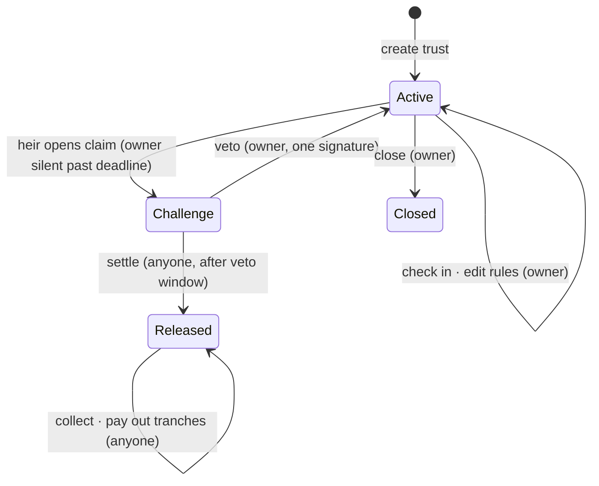

# Kinfolio

**A family trust for your stock-token portfolio, without the lawyer.**

Name heirs for your Robinhood Chain stock tokens and USDG, decide who gets what, when and how fast, and keep every token in your own wallet while you're alive.

**[▶ Demo video](https://youtu.be/9TGgFGu0Alg)** · **[Live app](https://kinfolio-ten.vercel.app)** (Mainnet / Testnet switch) · **[Mainnet factory](https://robinhoodchain.blockscout.com/address/0xbdEF1e8cb7DB12a81d6C32f5E57D2ccE41b4A90F)** · **[Testnet factory](https://explorer.testnet.chain.robinhood.com/address/0xbdEF1e8cb7DB12a81d6C32f5E57D2ccE41b4A90F)** · [Architecture](docs/ARCHITECTURE.md) · [Security](docs/SECURITY.md)

Built for **Arbitrum Open House Singapore** on **Robinhood Chain**.

---

## The problem

The Robinhood app lets you name transfer-on-death beneficiaries. The moment you withdraw stock tokens to self-custody, that protection is gone, and your family needs your private keys, which they almost never have. Existing onchain inheritance tools either **lock your assets in escrow**, which an active investor can't accept, or rely on **custodians to declare you dead**. None of them can express how families actually pass on wealth: in tranches, at certain ages, as an allowance.

## What Kinfolio does

- **No escrow.** Your trust holds an *allowance*, not your tokens. You keep trading. The trust can only pull your assets after it is released.
- **Trust rules, not just a split.** For example: 40% to a spouse at settlement, 30% to a child at 18 and 30% at 25, each paid at once or gradually.
- **A USDG allowance.** Pay USDG as a steady monthly-style stream, separate from the stock split. *Stocks for the long term, dollars for the monthly bills.*
- **One-tap veto.** If an heir opens a claim while you're alive, a single signature cancels it and resets your clock.
- **Zero admin keys.** No pause, no upgrade, no fee switch. Nobody can change the rules, including us.
- **Live on mainnet, with a testnet demo.** Use real stock tokens on mainnet, priced live by **Chainlink**, or flip to Testnet to run the whole lifecycle in minutes.

## How it works



1. **Write the rules.** Pick the assets to cover, name your heirs, set tranches and timers, then sign once to create your trust and once per asset to approve it.
2. **Keep living.** Every Kinfolio action counts as a check-in. Your tokens never leave your wallet.
3. **If you go silent** past your deadline, an heir opens a claim. If you don't veto during the window, anyone can settle the trust. It collects your covered assets, and each tranche pays out to its named heir on schedule.

## Why it stands out

| | **Kinfolio** | Blop | Family.Cash |
|---|---|---|---|
| Where assets sit while you live | **Your wallet** (allowance only) | Escrowed in the vault | Held in a token-bound account |
| What releases them | Your silence plus an unvetoed challenge window | A quorum of custodians | Inactivity plus a grace period |
| Tranches, ages, gradual payouts | **Yes** | Not documented | Not documented |
| Separate USDG allowance | **Yes** | No | No |
| Split- and dividend-safe (ERC-8056) | **Yes, raw-unit accounting** | Not documented | Not documented |
| One paused ticker can't block settlement | **Yes, per-asset isolation** | Not documented | Not documented |
| Approvals isolated per family | **Yes, one clone per trust** | n/a | n/a |
| Live web app | **Yes** | Yes | No (contracts only) |

<sub>Competitor columns are based on their public repositories as of October 2026.</sub>

## How Kinfolio meets the judging criteria

| Criterion | Evidence |
|---|---|
| **Smart contract quality** | 75 unit and fuzz tests, 5 invariants over 16k random calls each, and fork tests of the **deployed** contracts on testnet and mainnet with real Robinhood tokens. **99.6% line and 97.9% branch coverage.** `forge build` and `forge lint` are clean. No admin keys. Full [threat model](docs/SECURITY.md). |
| **Product-market fit** | Every self-custody stock-token holder loses the transfer-on-death protection Robinhood offers inside its app. Kinfolio restores it without asking them to stop trading. It's especially relevant to cross-border families, whose heirs would otherwise have to prove an inheritance to a foreign broker. |
| **Innovation** | Allowance-based (non-custodial) inheritance; an isolated contract per family; trust-style tranches and vesting; a USDG cash sleeve; accounting that tracks corporate actions automatically (mainnet NVDA's multiplier is already above 1.0 from reinvested dividends). Portfolios are valued live through Chainlink's Robinhood Chain feeds. |
| **Real problem solving** | Heirs never need the owner's keys, a lawyer or Kinfolio itself: every settlement step can be called from a block explorer. |
| **USDG integration** | USDG is a first-class **cash sleeve** with its own heirs and streaming schedule, separate from the stock split. |

## Deployments

The same addresses on both chains:

| | Address | Profile |
|---|---|---|
| `KinfolioFactory` | `0xbdEF1e8cb7DB12a81d6C32f5E57D2ccE41b4A90F` | |
| `KinfolioTrust` (implementation) | `0x821D8133adfd1fc9aE2e90195C5Ac0E4bdbEdaD7` | |
| **Robinhood Chain mainnet** (4663) | [factory](https://robinhoodchain.blockscout.com/address/0xbdEF1e8cb7DB12a81d6C32f5E57D2ccE41b4A90F) · [deploy tx](https://robinhoodchain.blockscout.com/tx/0xc9be75746447ecd95ce36bd207734f70fff1961969a4116a87f61269dc1e0663) | production: 30-day minimum inactivity, 7-day minimum veto window. Verified on Sourcify. |
| **Robinhood Chain testnet** (46630) | [factory](https://explorer.testnet.chain.robinhood.com/address/0xbdEF1e8cb7DB12a81d6C32f5E57D2ccE41b4A90F) · [deploy tx](https://explorer.testnet.chain.robinhood.com/tx/0xa345d4dc783ee8bba33fbb4fb51b77eba954dd5d308701d79090f1404c789ae5) | demo: 60-second minimums, so the full lifecycle fits in a video. Verified on Blockscout. |

The cash asset is Paxos **USDG** on each chain. Machine-readable records are in [`contracts/deployments/`](contracts/deployments).

## Proof it works

A full lifecycle run through the web app with real wallets on testnet: create, claim, veto, claim again, settle, collect and pay out.

- **Trust:** [`0xFfbBE036…BC86a`](https://explorer.testnet.chain.robinhood.com/address/0xFfbBE0369030D171dC2D783E77f7797707BbC86a). It covered TSLA, AMZN, NFLX, PLTR, AMD and USDG.
- **Spouse (40% at settlement):** received 4 of each stock and 40 USDG. The payout was [triggered by the child](https://explorer.testnet.chain.robinhood.com/tx/0x76f4129a80006d2d76e499ef1894b06a7d6d35e2d32fa8f1d730fdb5b7af9b14), but the tokens went to the spouse, because payouts can't be redirected.
- **Child (30% + 30%, two unlock times):** each tranche paid out after its own unlock.
- **Afterwards:** zero tokens remain in the trust, so every unit is accounted for.

## Security

- No escrow. The only `transferFrom` is reachable only after release, and only from the owner to the trust.
- Each trust is an isolated clone with no admin, upgrade or pause.
- Payouts go only to stored heirs. Anyone can trigger them; nobody can redirect them.
- Issuer pauses are isolated per asset, and accounting is in raw units so ERC-8056 corporate actions pass straight through.

See **[docs/SECURITY.md](docs/SECURITY.md)** for invariants I1–I7 and the tests that prove each one, the attack tree, the static-analysis rationale and the known limitations.

## Run it

**Contracts** (Foundry):

```bash
cd contracts
forge test                                 # everything, including fork tests of the deployed contracts
forge test --mp "test/fork/*" -j 1         # fork tests only, one at a time (public RPCs rate-limit)
forge test --no-match-path "test/fork/*"   # offline
forge coverage --no-match-path "test/fork/*" --no-match-coverage "test|script"
```

**Web app** (Next.js 16, wagmi 3, viem):

```bash
cd web
npm install
npm run dev       # http://localhost:3000
npm run abi       # regenerate ABIs after `forge build`
```

Optional: set `NEXT_PUBLIC_RPC_MAINNET` and/or `NEXT_PUBLIC_RPC_TESTNET` to private RPC URLs. The public RPCs are used as a fallback.

The app defaults to **Testnet**, so anyone can try the full lifecycle in minutes. Switch to **Mainnet** in the header to use real assets. Mainnet covers TSLA, NVDA, AAPL, MSFT, AMZN, GOOGL, META, PLTR, AMD, COIN, SPY, QQQ and USDG, each priced by Chainlink.

## Repository layout

```
contracts/
  src/              KinfolioFactory.sol · KinfolioTrust.sol · libraries/Vesting.sol · interfaces/
  test/             lifecycle · settlement · factory · vesting fuzz · invariant/ · fork/
  script/           Deploy.s.sol (picks the testnet or mainnet profile from the chain id)
  deployments/      46630.json · 4663.json
web/                Next.js app: landing, trust builder, trust page, dashboard
docs/               ARCHITECTURE.md · SECURITY.md
```

## Roadmap

- **Keeper and notifications:** automatic settlement on time, plus email and push reminders before the deadline.
- **Grant-change timelock** and change alerts, as protection against a compromised owner key.
- **One-transaction setup** with EIP-2612 `permit` across all covered assets.
- **Encrypted letters to heirs** and a printable "inheritance letter" with the trust address.

## Disclaimer

Kinfolio complements a will; it is not legal advice and does not replace one. The contracts are unaudited buildathon software. Use them at your own risk.
