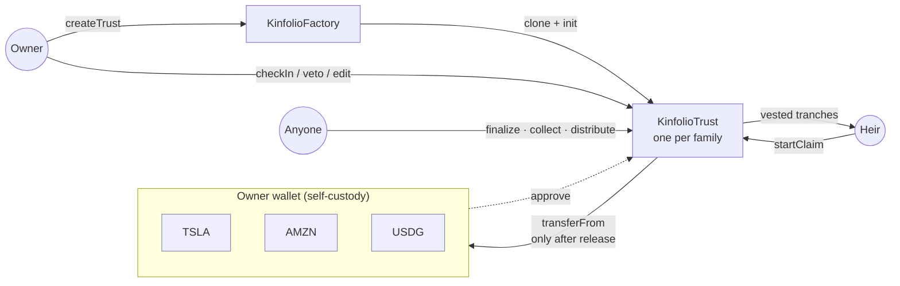
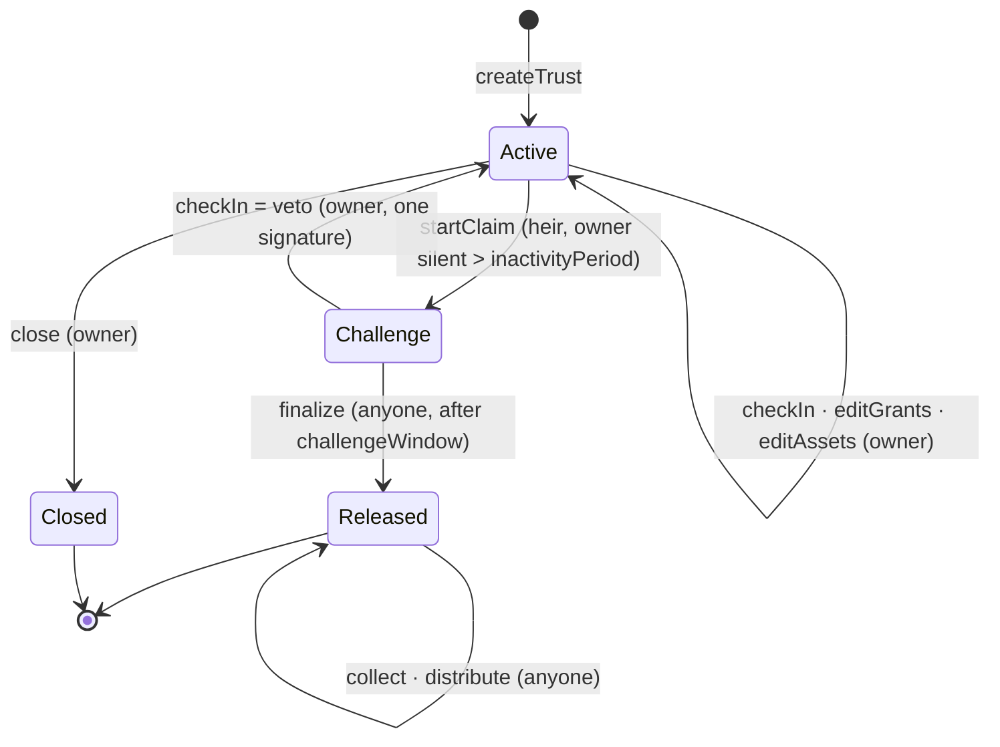

# Kinfolio Architecture

> A family trust for your stock-token portfolio, without the lawyer.

Kinfolio lets a self-custody investor on Robinhood Chain name heirs for their stock tokens and USDG with trust-style rules: who gets what, when, and how fast. The tokens never leave the owner's wallet while they are alive. If the owner goes silent past a deadline they set, and does not veto during a challenge window, the trust settles onchain with no lawyer, custodian or Kinfolio server involved.

---

## 1. Problem

The Robinhood app lets you name transfer-on-death beneficiaries. When you withdraw stock tokens to self-custody, you lose that. Your heirs then need your private keys, and they rarely have them.

Existing onchain inheritance tools solve this by **escrowing** your assets in a vault, so you can't trade them, or by **trusting a quorum of custodians** to declare you dead. Neither fits an active investor, and neither expresses how families actually pass on wealth: in tranches, at ages, as allowances.

## 2. Design principles

| # | Principle | Consequence |
|---|---|---|
| P1 | **No escrow.** | Assets stay in the owner's wallet. The trust holds an ERC-20 allowance and can only use it after release. The owner keeps trading. |
| P2 | **One contract per family.** | Each trust is its own EIP-1167 clone. Approvals go to *your* trust, not to a shared pool, so a bug in one trust cannot be used to drain another. |
| P3 | **Zero admin.** | No owner, pauser, upgrader or fee switch on the factory or the implementation. Nobody can change the rules after deployment, including us. |
| P4 | **Destinations are never caller-supplied.** | Tokens only move owner → trust (at settlement) and trust → a stored beneficiary. A phished signature can trigger settlement but cannot redirect funds. |
| P5 | **Permissionless completion.** | `finalize`, `collect` and `distribute` can be called by anyone. If Kinfolio disappears, heirs can settle from a block explorer. |
| P6 | **Per-asset fault isolation.** | Stock tokens are pausable by the issuer. One paused ticker can never block the rest of an inheritance. |
| P7 | **Raw-unit accounting (ERC-8056).** | Entitlements are computed in raw token units. Splits and reinvested dividends move the `uiMultiplier`, not balances, so locked tranches keep compounding with zero code. |
| P8 | **No oracle on the money path.** | Chainlink prices feed the UI and view functions only. Settlement depends only on balances and time. |

## 3. System overview



| Component | Trust level | Role |
|---|---|---|
| `KinfolioFactory` | Immutable, no admin | Deploys the implementation once, clones a trust per owner (CREATE2, so the address is predictable), indexes trusts by owner and beneficiary. |
| `KinfolioTrust` | Immutable, no admin | The state machine, settlement and vesting. Holds no assets until release. |
| Web app (Next.js) | Untrusted convenience | Trust builder, owner dashboard, heir claim flow. Holds no keys, gates nothing. |
| Chainlink feeds | View-only | Portfolio valuation in the UI. Mainnet only; testnet uses mock feeds. |

There is no backend for the buildathon. Everything reads from the chain.

## 4. State machine



Timing rules, all `block.timestamp`, with strict `>` boundaries:

- Claimable when `now > lastCheckIn + inactivityPeriod`.
- Finalizable when `now > claimStartedAt + challengeWindow`.
- Every owner write resets `lastCheckIn`, so editing the trust is proof of life.

### Function matrix

| Function | Caller | Allowed in | Effect |
|---|---|---|---|
| `checkIn()` | owner | Active, Challenge | Resets `lastCheckIn`. In Challenge it acts as the **veto**: clears the claim and returns to Active. |
| `setGrants(grants[])` | owner | Active | Replaces the rules (validated, see §5). Checks in. |
| `setAssets(assets[])` | owner | Active | Replaces the covered token list. Checks in. |
| `setPeriods(inactivity, challenge)` | owner | Active | Within factory bounds. Checks in. |
| `close()` | owner | Active | Terminal. The trust can never pull funds. |
| `rescue(token)` | owner | Active | Returns tokens sent to the trust by mistake. |
| `startClaim()` | any beneficiary | Active | Requires owner silence. → Challenge. |
| `finalize()` | anyone | Challenge | Requires the window to have elapsed. → Released, sets `releasedAt`. |
| `collect(asset)` / `collectAll()` | anyone | Released | Pulls `min(balance, allowance)` from the owner. Records the balance delta. Can be repeated for late-arriving tokens. A failing asset emits `CollectFailed` and is skipped. |
| `distribute(grantId, asset)` / `distributeAll(grantId)` | anyone | Released | Sends vested, unreleased tokens to the grant's stored beneficiary. Failures are isolated per asset. |
| `transferGrant(grantId, to)` | that grant's beneficiary | Released | Lets an heir rotate a lost or blocked wallet without the owner. |

Strangers have no lever on the claim path. Only the owner can stop a claim, and only time can complete one.

## 5. The trust model: grants and sleeves

A trust covers a list of **assets** (up to 16 ERC-20s; in practice stock tokens plus USDG) and a list of **grants** (up to 12).

```solidity
enum Sleeve { Portfolio, Cash }

struct Grant {            // packs into one storage slot
    address beneficiary;  // where tokens go; never caller-supplied
    uint16  bps;          // share of the sleeve, in basis points
    uint40  unlockAt;     // earliest vesting start (0 = at release)
    uint32  vestDuration; // 0 = lump sum, else linear over this many seconds
    Sleeve  sleeve;
}
```

There are two **sleeves**:

- **Portfolio**: every covered stock token (and any other non-cash asset). Grant shares here must sum to exactly 10,000 bps.
- **Cash** (USDG): optional. If any grant uses it, its shares must sum to exactly 10,000 bps and USDG settles only through those grants. If none do, USDG falls back into the Portfolio sleeve.

That split matches how families think: *stocks for the long term, dollars for the monthly bills.*

### Expressing real trusts

| Intent | Grants |
|---|---|
| Spouse gets 40% now | `{spouse, 4000, 0, 0, Portfolio}` |
| Child gets 30% at 18 and the remaining 30% at 25 | `{child, 3000, 18th birthday, 0, Portfolio}`, `{child, 3000, 25th birthday, 0, Portfolio}` |
| Parent gets $USDG as a monthly allowance for 3 years | `{parent, 10000, 0, 3 years, Cash}` |

One beneficiary can hold several grants, which is how tranches are expressed.

### Settlement math

For grant `g` and asset `a`:

```
entitlement(g, a) = sleeveOf(a) == g.sleeve ? collected[a] * g.bps / 10_000 : 0
start             = max(releasedAt, g.unlockAt)
vested(g, a)      = now <= start            ? 0
                  : g.vestDuration == 0     ? entitlement
                  : min(entitlement, entitlement * (now - start) / g.vestDuration)
claimable(g, a)   = vested(g, a) - distributed[g][a]
```

- `collected[a]` is measured as the balance delta of each pull, so non-standard tokens can't inflate it.
- Every term is monotonic in time and in `collected`, so `claimable` never underflows, and a repeated `collect` simply raises future entitlements.
- Floor rounding leaves at most one wei per grant in the trust, which is negligible and documented.
- **ERC-8056.** All quantities are raw units. A 2:1 split doubles `uiMultiplier`, so every heir's locked tranche is worth twice the shares, and no state changes are needed.

## 6. Security model

The full attack tree is in `SECURITY.md` (carried over from AfterKey and extended for allowances). The invariants below become Foundry invariant and fuzz tests:

| ID | Invariant |
|---|---|
| I1 | No code path calls `transferFrom` unless `state == Released`. |
| I2 | `transferFrom` is only ever `owner → trust`. |
| I3 | Tokens leave the trust only to a stored grant beneficiary, or to the owner via `rescue` while Active. |
| I4 | For every asset: `Σ distributed[g][a] ≤ collected[a] ≤` tokens the trust has received for that asset. |
| I5 | No grant ever receives more than its vested entitlement. |
| I6 | Challenge → Active only by an owner signature; Challenge → Released only after the window. |
| I7 | No privileged role exists on the factory or the implementation. |

Hardening:

- OpenZeppelin `SafeERC20` (with `try*` variants for isolation)
- `ReentrancyGuard` on every function that moves tokens
- Checks-effects-interactions ordering
- An implementation that can't be initialized directly
- Bounded loops (16 assets × 12 grants)
- Validation of every grant: non-zero, not the owner, not the trust, shares sum per sleeve, bounded timestamps

Known, accepted risks, all disclosed in the README:

- The **issuer** can pause or burn stock tokens. That is outside our control, and it is isolated per asset.
- A compromised owner key can rewrite the grants. That is the same as a compromised wallet. A grant-change timelock and alerts are on the roadmap.
- A false release happens if the owner ignores both the inactivity deadline and the whole challenge window. This is mitigated by conservative production minimums (30 days inactivity, 7 days challenge).

## 7. Chain integration (verified onchain, 2026-10-01)

| | Testnet | Mainnet |
|---|---|---|
| Chain ID | `46630` | `4663` |
| Public RPC | `rpc.testnet.chain.robinhood.com` | `rpc.mainnet.chain.robinhood.com` |
| Explorer | `explorer.testnet.chain.robinhood.com` | `robinhoodchain.blockscout.com` |
| USDG (6 dp) | `0x7E955252E15c84f5768B83c41a71F9eba181802F` | `0x5fc5360D0400a0Fd4f2af552ADD042D716F1d168` |
| TSLA (18 dp) | `0xC9f9c86933092BbbfFF3CCb4b105A4A94bf3Bd4E` | `0x322F0929c4625eD5bAd873c95208D54E1c003b2d` |
| AMZN | `0x5884aD2f920c162CFBbACc88C9C51AA75eC09E02` | registry |
| NFLX | `0x3b8262A63d25f0477c4DDE23F83cfe22Cb768C93` | registry |
| Multicall3 | `0xcA11bde05977b3631167028862bE2a173976CA11` | same |
| Chainlink | none (the app shows demo prices) | live stock and USD feeds |
| PLTR | `0x1FBE1a0e43594b3455993B5dE5Fd0A7A266298d0` | registry |
| AMD | `0x71178BAc73cBeb415514eB542a8995b82669778d` | registry |
| **Kinfolio factory** | `0xbdEF1e8cb7DB12a81d6C32f5E57D2ccE41b4A90F` | same address |

Stock-token facts the design relies on, each checked against the live implementation:

- Standard OpenZeppelin ERC-20 with `approve`/`transferFrom`/`permit`.
- Transfers to both EOAs and contracts succeed.
- The issuer has `pause()` and `adminBurn()`.
- The ERC-8056 functions `uiMultiplier()`, `newUIMultiplier()`, `effectiveAt()` and `balanceOfUI()` are present.
- Chainlink stock feeds price one token, multiplier included, so valuation is `rawBalance × price`.

## 8. Web app

Next.js (App Router) + wagmi + viem + RainbowKit, with both Robinhood Chain networks configured. Pages:

- **`/`**: the pitch, how it works, and Kinfolio vs. alternatives.
- **`/create`**: the trust builder. It detects stock tokens and USDG in the wallet, adds heirs with tranche presets (*Now*, *At age…*, *Monthly over…*), sets the timers, and shows a review with a plain-English summary. It then deploys the trust and approves each asset.
- **`/trust/[address]`**: one page with role-aware views.
  - **Owner**: the countdown hero, an **I'm alive** button, portfolio value, per-asset coverage (`min(balance, allowance)`), and a tranche timeline.
  - **Heir**: what's coming, when it unlocks, and Claim / Settle / Withdraw.
  - **Anyone**: the settle buttons.
- **`/heirs`**: trusts that name the connected wallet, from the factory index.

## 9. Deployment profiles

The factory takes its timing minimums as constructor arguments, and they are baked into the implementation as immutables:

| Profile | Min inactivity | Min challenge | Purpose |
|---|---|---|---|
| `demo` (testnet) | 60 s | 60 s | Full lifecycle on video in minutes |
| `production` (mainnet) | 30 days | 7 days | Real funds |

## 10. Repository layout

```
kinfolio/
├── contracts/            Foundry project
│   ├── src/              KinfolioFactory.sol, KinfolioTrust.sol, interfaces/, libraries/
│   ├── test/             unit · fuzz · invariant · fork
│   └── script/           Deploy.s.sol, Demo.s.sol
├── web/                  Next.js app
├── docs/                 ARCHITECTURE.md, SECURITY.md
└── README.md             judge-facing overview
```

## 11. Out of scope (buildathon)

The following are out of scope for the buildathon:

- Email or push notifications (needs a backend)
- Encrypted letters to heirs
- Grant-change timelock
- Guardians
- Swapping to USDG at settlement
- Permit-based one-transaction setup

All of these are roadmap items, not hidden gaps.

## 12. Milestones

| # | Milestone | Status |
|---|---|---|
| M1 | Core trust + factory | ✅ State machine, grants and sleeves, unit tests |
| M2 | Settlement + hardening | ✅ Collect/distribute/vesting; fuzz and invariant suites (I1–I7); fork test against live testnet tokens |
| M3 | Testnet deploy | ✅ Demo-profile factory deployed and verified on chain 46630 |
| M4 | Web app | ✅ Create → claim → veto → settle → collect → pay out, run in the browser with real wallets ([live](https://kinfolio-ten.vercel.app)) |
| M5 | Mainnet | ✅ Production-profile factory on chain 4663, verified on Sourcify. The app has a Mainnet/Testnet switch, with live Chainlink valuation on mainnet. |
| M6 | Submission | README, SECURITY.md, deck, demo video, HackQuest entry |
